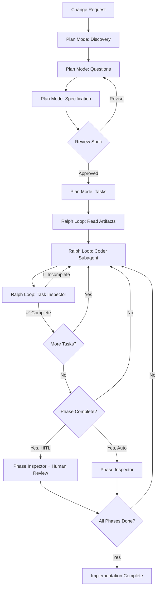

# Craftsman

**Plan Mode and "Ralph" implementation loop Workflows for GitHub Copilot**

Craftsman is a collection of specialized AI agent modes that transform
how you plan, implement, and verify complex software changes in VS Code.

Instead of endless manual prompting, Craftsman provides structured workflows
that ensure quality through systematic planning, autonomous implementation,
and continuous validation.

[[_TOC_]]

## Why Craftsman?

Craftsman is an **experiment in structured agent orchestration**, exploring three key questions:

### 1. Can models reliably follow complex workflows?

Using **XML-like tags and structured prompts**, Craftsman tests whether LLMs can execute multi-phase processes (discovery → interview → specification → planning → implementation → verification) without losing track of their role or breaking the workflow.

### 2. Can we integrate external issue trackers seamlessly?

Real teams use JIRA, Linear, or GitHub Issues.
Craftsman uses the **JIRA-ID naming convention** (`.agents/changes/JIRA-123-description/`)
to maintain traceability between planning artifacts and external project management systems.

### 3. Can we implement linearly without constant manual prompting?

Inspired by the **["Ralph Wiggum" pattern](https://www.humanlayer.dev/blog/brief-history-of-ralph)**,
a simple loop that repeatedly delegates to subagents until all tasks are complete.

Craftsman adapts this approach for **VS Code GitHub Copilot**.

Instead of:

- Writing new prompts for each implementation step
- Manually tracking which tasks are done
- Hoping the agent remembers earlier context

**Ralph Loop** does:

- Read the progress file
- Delegate next task to a fresh Coder subagent
- Verify the result with Inspector subagent
- Update progress
- Repeat until complete

This is **linear, stateful, and autonomous** — you start the loop and step away.

## Core Agent Modes

Craftsman currently provides two complementary agent modes:

### 🎯 Plan Mode

**A research and planning agent that produces reviewable specifications and actionable task breakdowns.**

Plan Mode systematically explores your change request through:

1. **Deep context discovery** — scans your project structure, documentation, and existing patterns
2. **Structured interviews** — asks 10-15 clarifying questions, then 5-10 technical follow-ups
3. **Specification generation** — produces a reviewable spec with requirements, constraints, and success criteria
4. **Implementation planning** — creates detailed architectural plan with dependencies
5. **Task breakdown** — generates independent, actionable task files for implementation

**Output artifacts** (in `.agents/changes/<JIRA>-<description>/`):

```text
.agents/changes/JIRA-123-feature-name/
├── 00.request.md              # Initial change request
├── 01-specification.md        # Reviewable design decisions and requirements
├── 02-plan.md                 # Technical architecture and dependencies
├── 03-tasks-01-models.md      # Phase 1, Task 1: Data models
├── 03-tasks-02-api.md         # Phase 1, Task 2: API endpoints
├── 03-tasks-03-tests.md       # Phase 2, Task 3: Unit tests
└── 03-tasks-04-docs.md        # Phase 2, Task 4: Documentation
```

**Key principle**: Plan Mode **never writes implementation code**. It focuses exclusively on thorough planning so implementation agents have clear, complete instructions.

**Files Description**:

- `00.request.md`: The initial human request, often a poorly written JIRA ticket.
- `01-specification.md`: The main output of Plan Mode, containing reviewable design and architectural choices without technical details or code.
- `01-specification.jira.txt`: A JIRA-friendly version of the specification
  for easy putting issues in review in JIRA.
- `02-plan.md`: A highly technical architecture plan that includes task dependencies
  and low-level details. This file is never used after task breakdown is finished.

### 🔄 Ralph Loop Mode

**An orchestration agent that autonomously implements tasks with continuous verification.**

Ralph Loop manages the complete implementation lifecycle:

1. **Reads planning artifacts** — loads spec, plan, and task files from Plan Mode
2. **Delegates to Coder subagent** — selects next task, triggers implementation subagent
3. **Runs Task Inspector** — verifies each completed task meets acceptance criteria
4. **Manages phase transitions** — validates phase completion before proceeding
5. **Human-in-the-Loop (HITL)** — optional pause points for stakeholder review
6. **Progress tracking** — maintains PROGRESS.md with task status and validation notes

**Two operational modes**:

- **Auto Mode** — continuous implementation until all tasks complete
- **HITL Mode** — pauses at phase boundaries for human validation

**Verification system**:

- **Task Inspector** — validates individual task completion after each Coder run
- **Phase Inspector** — generates comprehensive phase review reports
- **Retry mechanism** — marks incomplete tasks as 🔴 for priority rework

---

## Workflow Structure

Craftsman organizes work in `.agents/changes/<JIRA-ID>-<description>/`:

```
.agents/changes/IDEA-01-refresh-command/
├── 00.request.md              # Initial human request (Plan Mode input)
├── 01-specification.md        # Reviewable spec (Plan Mode output)
├── 02-plan.md                 # Technical architecture (Plan Mode output)
├── 03-tasks-00-READBEFORE.md  # Context for all tasks (Plan Mode output)
├── 03-tasks-01-*.md           # Phase 1 tasks (Plan Mode output)
├── 03-tasks-02-*.md           # Phase 2 tasks (Plan Mode output)
├── ...
└── PROGRESS.md                # Task status tracking (Ralph Loop maintains)
```

**Progressive disclosure design**: Each task file is self-contained with just enough context for a fresh agent to implement it, reducing cognitive overload and token waste.

**Subagents**:

- **Coder**: implements individual tasks based on task files
- **Task Inspector**: verifies task completion against acceptance criteria
- **Phase Inspector**: validates phase completion and generates review reports

## Installation

**Current method** (manual):

1. **Add Craftsman to your workspace**:
   ```bash
   # Clone or download Craftsman
   git clone https://github.com/your-org/Craftsman.git ~/Projects/Craftsman
   ```

2. **Copy agent modes to your project**:
   ```bash
   cd /path/to/your-project
   mkdir -p .github/agents
   cp ~/Projects/Craftsman/.github/agents/*.agent.md .github/agents/
   ```

3. **Open Craftsman project in VS Code workspace**:
   - In VS Code, use `File > Add Folder to Workspace`
   - Add the Craftsman folder to your workspace
   - This makes agent definitions available to GitHub Copilot

4. **Access agents in Copilot Chat**:
   - Click the agent picker in Copilot Chat
   - Select "Craftsman: Plan Mode" or "Craftsman: Ralph Loop"

**Future**: A simple CLI installer is planned to automate this setup.

## Quick Start

### Planning a Change

1. Start Copilot Chat and select **@Craftsman: Plan Mode**
2. Provide your change request (or paste JIRA ticket)
3. Answer the clarifying questions
4. Review the generated specification
5. Approve plan and task breakdown

### Implementing with Ralph Loop

1. Start Copilot Chat and select **@Craftsman: Ralph Loop**
2. Choose operational mode:
   - **Auto Ralph Loop** — autonomous end-to-end implementation
   - **Human-in-the-Loop Ralph Loop** — pause at phase boundaries
3. Provide path to planning artifacts (e.g., `.agents/changes/IDEA-01-refresh-command/`)
4. Ralph Loop will:
   - Read spec, plan, and tasks
   - Delegate implementation to Coder subagents
   - Verify each task with Task Inspector
   - Track progress in PROGRESS.md
   - Continue until all tasks complete

**Pausing Ralph Loop**: Create `PAUSE.md` in the planning folder to safely pause the loop for manual task edits.

---

## Typical End-to-End Workflow



## Project Status

**Version**: 0.8
**Status**: Production-ready for experimentation
**License**: MIT (see [LICENSE](LICENSE))

---

## Honest Feedback: Current Limitations

Craftsman is a **production-level proof of concept**
that demonstrates systematic agent workflows
work in practice, but it has known limitations:

### Known Issues

1. **Task selection autonomy**: The orchestrator sometimes chooses tasks and sends task numbers to the Coder subagent, despite instructions stating "let the subagent choose". This creates unnecessary coupling.

2. **Phase Inspector underutilized**: The Phase Inspector is rarely triggered in practice, reducing phase-boundary validation effectiveness.

3. **Rate limit recovery failures**: When hitting GitHub Copilot daily/weekly rate limits, retry behavior degrades:
   - Orchestrator "forgets" to trigger subagents
   - Implementation happens in orchestrator instead of Coder subagent
   - **Workaround**: Start a fresh chat session

4. **Feature completeness vs. accessibility gap**: The most significant limitation — at completion:
   - ✅ All features are typically implemented
   - ✅ Complete preflight checks pass
   - ✅ Unit tests pass
   - ✅ Code quality is high
   - ❌ **But features may not be user-accessible** (especially with UI)

   Despite intensive planning with Claude Opus and no visible gaps in specifications, implemented features sometimes exist in code but lack integration points, UI bindings, or entry points for users to actually use them.

## Call for Contributors

Craftsman is an **open research project**. We're exploring systematic agent workflows for complex software development, and we need your help:

## Acknowledgments

Inspired by the "Ralph Wiggum" loop concept and refined through experimentation with GitHub Copilot's Agent Mode system.

**Read more**:
- [Original Reddit post](https://www.reddit.com/r/GithubCopilot/comments/1qapkdg/ralph_wiggum_technic_in_vs_code_copilot_with/)
- [X/Twitter thread](https://x.com/stibbons31/status/2020456046259589229)
